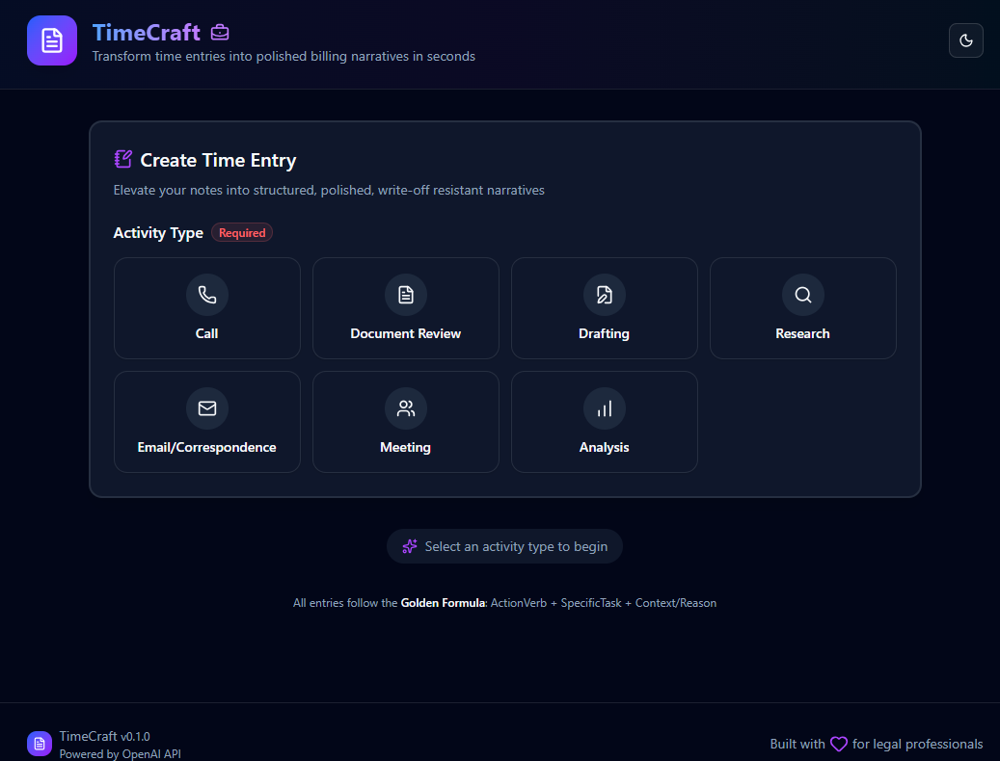

# TimeCraft

**Legal Billing Made Easy** - Helping legal professionals craft polished billing descriptions in seconds.

TimeCraft is a Next.js application that transforms raw time entries into professional billing narratives using AI. Every output follows the "Golden Formula": **ActionVerb + SpecificTask + Context/Reason (Value)**.



---

## ✨ Features

- 🤖 **AI-Powered Generation** - Uses OpenAI GPT-4o-mini for polished narratives
- 🔄 **Automatic Fallback** - Rule-based transformation when API unavailable
- 📜 **Session History** - Track all generated entries (session-only, doesn't persist)
- 🎨 **Dark Mode** - Beautiful UI with light/dark theme toggle
- ✅ **Smart Validation** - Progressive disclosure with Zod validation
- 📋 **Copy to Clipboard** - One-click copy with confetti celebration
- 🎯 **Format Customization** - Choose numbered, bullets, hyphens, or plain text
- 🎭 **Smooth Animations** - Polished transitions with Framer Motion
- 🔔 **Toast Notifications** - Beautiful feedback for all actions
- 💡 **Helpful Tooltips** - Contextual help throughout the interface
- ⚡ **Rate Limiting** - Built-in cost controls and abuse prevention
- ♿ **Accessible** - WCAG AA compliant, keyboard navigable
- 📱 **Responsive** - Works on desktop, tablet, and mobile

---

## 🚀 Quick Start

### Prerequisites

- Node.js 18+ installed
- OpenAI API key ([Get one here](https://platform.openai.com/api-keys))

### Installation

1. **Clone the repository**
   ```bash
   git clone <your-repo-url>
   cd time-entry-gen
   ```

2. **Install dependencies**
   ```bash
   npm install
   ```

3. **Set up environment variables**
   ```bash
   cp .env.example .env.local
   ```
   
   Edit `.env.local` and add your OpenAI API key:
   ```env
   OPENAI_API_KEY=sk-your-actual-api-key-here
   ```
   
   **⚠️ Important:** Do NOT use `NEXT_PUBLIC_` prefix - this would expose your key to the browser!

4. **Run the development server**
   ```bash
   npm run dev
   ```

5. **Open in browser**
   
   Navigate to [http://localhost:3000](http://localhost:3000)

---

## 📖 How to Use

### 1. Select Activity Type
Choose from 7 activity types:
- **Call** - Telephone conferences
- **Document Review** - Analyzing documents
- **Drafting** - Creating documents
- **Research** - Legal research
- **Email/Correspondence** - Written communications
- **Meeting** - Strategy conferences
- **Analysis** - Strategic analysis

### 2. Fill in Details
- **Subject/Who/What**: Who or what was involved (e.g., "Founder", "Term Sheet")
- **Goal/Purpose**: What was the objective (e.g., "discuss funding structure")
- **Time Duration** (Optional): Time in 0.1 hour increments
- **Client/Matter** (Optional): Client and matter information
- **Output Format** (Optional): Choose numbered (default), bullets, hyphens, or plain text

### 3. Generate
Click "Generate Billing Narrative" and get a professional output like:

> "Telephone conference with Founder regarding Series A funding structure to determine optimal capitalization strategy and liquidation preferences."

### 4. Customize Format (Optional)
Toggle between different formats after generation:
- **Numbered** (1. 2. 3.) - Default
- **Bullets** (• • •)
- **Hyphens** (- - -)
- **None** (Plain text)

### 5. Copy & Use
Click "Copy to Clipboard" (with confetti celebration!) and paste into your billing system.

---

## 🎯 The Golden Formula

Every generated narrative follows this structure:

```
ActionVerb + SpecificTask + Context/Reason (Value)
```

**Example Transformations:**

| Input | Output |
|-------|--------|
| "call with founder" | "Telephone conference with Founder regarding [topic] to determine next steps" |
| "reviewing term sheet" | "Analyzed Series A Term Sheet to identify non-standard control provisions" |
| "emails re cap table" | "Correspondence with client regarding capitalization table reconciliation" |

---

## 🛡️ API Rate Limits & Cost Controls

TimeCraft includes built-in rate limiting to prevent abuse and control costs:

| Limit | Value | Purpose |
|-------|-------|---------|
| Per Minute | 10 requests | Prevent rapid-fire |
| Per Hour | 60 requests | Sustained usage |
| Per Day | 200 requests | Daily cap (~$0.06/day) |

**Cost Estimate:** ~$0.30 per 1,000 requests with GPT-4o-mini

See [docs/api-controls.md](docs/api-controls.md) for details.

---

## 🏗️ Tech Stack

- **Framework**: Next.js 16 (App Router)
- **Language**: TypeScript
- **Styling**: TailwindCSS v4 + shadcn/ui
- **Forms**: React Hook Form + Zod
- **AI**: OpenAI GPT-4o-mini
- **Animations**: Framer Motion
- **Notifications**: Sonner (toast notifications)
- **Celebrations**: Canvas Confetti
- **Tooltips**: Radix UI Tooltip
- **Icons**: Lucide React
- **Theme**: next-themes

---

## 📁 Project Structure

```
time-entry-gen/
├── app/                    # Next.js app directory
│   ├── layout.tsx         # Root layout with theme provider
│   ├── page.tsx           # Main application page
│   └── globals.css        # Global styles
├── components/            # React components
│   ├── ui/               # shadcn/ui components
│   │   ├── button.tsx
│   │   ├── card.tsx
│   │   ├── input.tsx
│   │   ├── textarea.tsx
│   │   ├── select.tsx
│   │   ├── tooltip.tsx
│   │   └── skeleton.tsx
│   ├── activity-selector.tsx
│   ├── entry-form.tsx
│   ├── output-display.tsx
│   ├── output-skeleton.tsx
│   ├── session-history.tsx
│   └── theme-toggle.tsx
├── lib/                   # Utilities and logic
│   ├── openai-client.ts  # OpenAI API integration
│   ├── prompt-builder.ts # Prompt engineering
│   ├── fallback-transformer.ts
│   ├── transformation-engine.ts
│   ├── rate-limiter.ts   # Rate limiting & cost controls
│   ├── constants.ts      # Activity definitions
│   └── utils.ts          # Helper functions
├── types/                 # TypeScript type definitions
│   └── index.ts
└── docs/                  # Documentation
    ├── vision.md
    ├── technical-architecture.md
    ├── roadmap.md
    ├── api-controls.md
    ├── testing-checklist.md
    └── future-enhancements.md
```

---

## 🧪 Testing

Comprehensive manual testing checklist available in [docs/testing-checklist.md](docs/testing-checklist.md).

**Test Coverage:**
- ✅ All 7 activity types
- ✅ Form validation
- ✅ AI and fallback modes
- ✅ Session history
- ✅ Rate limiting
- ✅ Accessibility (WCAG AA)
- ✅ Cross-browser (Chrome, Firefox)

---

## 🚢 Deployment

### Deploy to Vercel

1. Push your code to GitHub
2. Import project in [Vercel](https://vercel.com)
3. Add environment variable:
   - Key: `OPENAI_API_KEY` (no `NEXT_PUBLIC_` prefix!)
   - Value: Your OpenAI API key
   - **Important:** Do NOT check "Expose to client"
4. Deploy!

### Build for Production

```bash
npm run build
npm start
```

---

## 🔒 Security Notes

**✅ Secure (Current):**
- API key is server-side only (never exposed to browser)
- All OpenAI calls go through `/api/generate` route
- Environment variable uses `OPENAI_API_KEY` (no `NEXT_PUBLIC_` prefix)
- Rate limiting prevents accidental abuse

---

## 📚 Documentation

- **[Vision Document](docs/vision.md)** - Product vision and Golden Formula
- **[Technical Architecture](docs/technical-architecture.md)** - System design
- **[API Controls](docs/api-controls.md)** - Rate limiting and cost management
- **[Testing Checklist](docs/testing-checklist.md)** - QA procedures
- **[Future Enhancements](docs/future-enhancements.md)** - Planned features
- **[Roadmap](docs/roadmap.md)** - Development timeline

---

## 🤝 Contributing

This is currently a solo MVP project. Future contributions welcome!

---

## 📝 License

MIT License - feel free to use for personal or commercial projects.

---

## 🙏 Acknowledgments

- Built with [Next.js](https://nextjs.org)
- UI components from [shadcn/ui](https://ui.shadcn.com)
- Powered by [OpenAI](https://openai.com)
- Icons by [Lucide](https://lucide.dev)

---

## 📧 Support

For issues or questions, please open an issue on GitHub.

---

**Status:** ✅ Portfolio Ready - Phase 6 UI/UX Polish Complete  
**Version:** 0.1.0  
**Last Updated:** November 20, 2025
